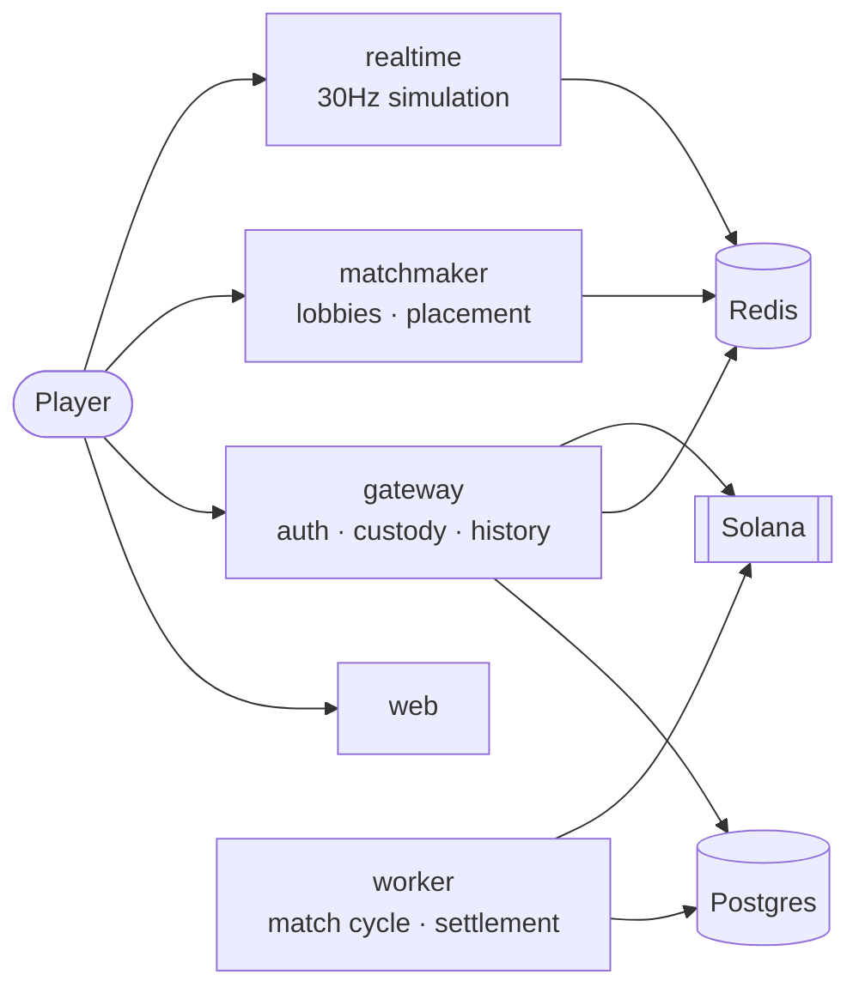

# Slither Arena

A browser-based multiplayer snake arena with on-chain custody on Solana.
Turborepo monorepo: a Next.js client, four Node services, an Anchor program, and
the shared packages they compile against.

Designed for 100,000+ concurrent players — the constraint that drove most of the
architecture, and the one worth reading [SCALING.md](docs/SCALING.md) for.



## Status

Working end to end, with two honest caveats.

| Area                              | State                                                    |
| --------------------------------- | -------------------------------------------------------- |
| Simulation, rendering, netcode    | Implemented, tested                                      |
| Wallet auth, JWT, sessions        | Implemented, tested                                      |
| Deposits, withdrawals, ledger     | Implemented, tested                                      |
| Lobbies, matchmaking, tickets     | Implemented, tested                                      |
| Admin dashboard                   | Implemented, tested                                      |
| Anchor program                    | Written; **arithmetic tested, never run on a validator** |
| Entry-fee escrow, winner-take-all | Implemented, tested                                      |
| Match cycle (BullMQ stages)       | Runs; unverified past `close-lobby`                      |

**Known gaps**, tracked rather than hidden:

- The program has never been built for SBF or executed. `cargo test` covers the
  settlement arithmetic; the account plumbing is unverified. See
  [ONCHAIN.md](docs/ONCHAIN.md#verification-status).
- The 10-minute cycle runs but has never completed a full match end to end,
  because that needs the deployed program.
- `POST /v1/internal/rooms` (matchmaker) and three gateway read endpoints still
  return `501`. Marked as such in the OpenAPI spec.
- Reward claims mark `CLAIMED` without posting ledger legs. Deliberately not
  faked — moving the status without the money would put the books out.

Nothing in this repo has run against real Postgres, Redis, Docker, or a Solana
validator. What _has_ been verified is in [TESTING.md](docs/TESTING.md).

## Quick start

Requires **Node 22.22+**, **pnpm 9**, and Docker. (Node 20 reached end of life in
April 2026, and the Solana wallet-adapter chain requires 22+.)

```bash
pnpm install
cp .env.example .env          # then set JWT_SECRET to 32+ random chars
pnpm docker:up                # Postgres, PgBouncer, Redis
pnpm db:migrate               # apply schema
pnpm db:seed                  # seven room tiers
pnpm dev                      # everything, in watch mode
```

| Service    | URL                                                        |
| ---------- | ---------------------------------------------------------- |
| Web        | http://localhost:3000                                      |
| Gateway    | http://localhost:4000 · [docs](http://localhost:4000/docs) |
| Realtime   | http://localhost:4001                                      |
| Matchmaker | http://localhost:4002 · [docs](http://localhost:4002/docs) |

Verify a checkout without any infrastructure:

```bash
pnpm build && pnpm typecheck && pnpm lint && pnpm test
```

## Repository layout

```
apps/
  web/          Next.js 15 client — PixiJS renderer, wallet, admin dashboard
  gateway/      Fastify — auth, custody, ledger, history, admin API
  matchmaker/   Fastify — lobby queues, node placement, join tickets
  realtime/     Socket.IO — authoritative 30Hz simulation, one world per room
  worker/       BullMQ — 10-minute match cycle, settlement, reconciliation

packages/
  protocol/     Shared kernel: wire contracts, Zod schemas, binary codec
  game-core/    Pure deterministic simulation — no I/O, shared client + server
  lobby/        Queue domain (pure reducer) + Redis adapter
  db/           Prisma schema, migrations, PGlite test harness
  solana/       Program SDK, RPC pool, retry, circuit breaker, signature auth
  redis/        Clients, key helpers, distributed locks
  env/          Zod-validated configuration, one schema per service
  logger/       Pino with redaction of tokens, signatures and keypairs
  ui/           Shared React primitives

programs/       Anchor program (Rust) + TypeScript integration suite
tests/
  e2e/          Playwright — real browser, production build
  load/         k6 and Socket.IO soak scripts
```

The dependency rule: **nothing in `packages/` imports from `apps/`**, and
`game-core` imports no infrastructure at all. See
[ARCHITECTURE.md](docs/ARCHITECTURE.md#the-dependency-rule).

## Architecture in one page

Five services, split by **failure domain and scaling axis** rather than by layer:

| Service      | Scales on     | State               | If it dies                             |
| ------------ | ------------- | ------------------- | -------------------------------------- |
| `web`        | CDN edge      | none                | site down, live games continue         |
| `gateway`    | request rate  | none                | no sign-in or deposits; games continue |
| `matchmaker` | poll rate     | none (Redis)        | no new joins; games continue           |
| `realtime`   | tick headroom | **rooms in memory** | those rooms end; others fine           |
| `worker`     | queue depth   | none                | settlement backs up, then recovers     |

Three decisions shape everything else:

- **A room never spans a process.** Sharding one would need a distributed lock
  per collision check at 30 Hz — slower than the simulation it protects. The
  room is the unit of sharding.
- **The client predicts, the server decides.** Both run the same `game-core`
  module, so prediction and authority cannot drift. Only _intent_ travels
  upward; positions and scores travel down.
- **Money is double-entry in Postgres.** Balances are pool accounts, not a
  column, which is what makes `SUM(pools) == SUM(posted entries)` checkable at
  all.

## Testing

**756 tests across six layers, all runnable with no external services.**

```bash
pnpm test            # 704 vitest — unit, integration, multiplayer
pnpm test:contract   # 26 cargo — on-chain settlement arithmetic
pnpm test:e2e        # 26 Playwright — real Chromium + Pixel 7
pnpm test:load       # simulation tick-budget measurements
pnpm test:all        # everything
```

Integration tests run against **real Postgres** (PGlite/WASM, migrations
executed) and **real Socket.IO** over a real port. Only what genuinely needs a
network is substituted — see [TESTING.md](docs/TESTING.md).

## Scripts

| Command                             | Description                                  |
| ----------------------------------- | -------------------------------------------- |
| `pnpm dev`                          | Everything in watch mode                     |
| `pnpm dev:services`                 | Gateway + realtime + matchmaker + worker     |
| `pnpm build`                        | Build all packages via Turborepo             |
| `pnpm lint` · `pnpm typecheck`      | ESLint · `tsc --noEmit`                      |
| `pnpm format`                       | Prettier write                               |
| `pnpm env:check`                    | Validate `.env` against every service schema |
| `pnpm openapi`                      | Emit OpenAPI specs to `docs/api/`            |
| `pnpm db:migrate` · `db:deploy`     | Create and apply migrations · apply only     |
| `pnpm db:studio` · `db:seed`        | Prisma Studio · seed room tiers              |
| `pnpm docker:up` · `docker:build`   | Start data stores · build images             |
| `pnpm anchor:build` · `anchor:test` | Build for SBF · run against a validator      |

## Environment

Every variable is declared in a Zod schema under `packages/env` and validated at
boot, so a misconfigured deploy fails immediately with a list of every problem
rather than a null-pointer at request time.

`.env.example` is the reference. Three things worth internalising:

- `NEXT_PUBLIC_*` values are inlined into the browser bundle **at build time** —
  changing one needs a rebuild, not a restart.
- `DIRECT_DATABASE_URL` must bypass PgBouncer; Prisma migrations use
  session-level features transaction pooling does not support.
- `NODE_ENV` is deliberately absent — setting it here leaks development mode
  into `next build`. The runtime owns it.

## Documentation

| Document                                | Covers                                                                            |
| --------------------------------------- | --------------------------------------------------------------------------------- |
| [ARCHITECTURE.md](docs/ARCHITECTURE.md) | Contexts, dependency rule, where Clean Architecture applies and where it does not |
| [SEQUENCES.md](docs/SEQUENCES.md)       | Seven flows, each with the failure it is shaped to survive                        |
| [DATA-MODEL.md](docs/DATA-MODEL.md)     | Every table, index and relation, with rationale                                   |
| [API.md](docs/API.md)                   | REST surface, conventions, Swagger                                                |
| [ONCHAIN.md](docs/ONCHAIN.md)           | Anchor program: accounts, instructions, guarantees                                |
| [SECURITY.md](docs/SECURITY.md)         | Nine defensive layers, and the known gaps                                         |
| [NETWORKING.md](docs/NETWORKING.md)     | Wire protocol, prediction, interpolation                                          |
| [SCALING.md](docs/SCALING.md)           | Capacity model and bottleneck analysis                                            |
| [DEPLOYMENT.md](docs/DEPLOYMENT.md)     | Environments, secrets, rollout, rollback                                          |
| [OPERATIONS.md](docs/OPERATIONS.md)     | Runbooks, metrics, alerts                                                         |
| [ADMIN.md](docs/ADMIN.md)               | Operator dashboard, audit trail, reconciliation                                   |
| [TESTING.md](docs/TESTING.md)           | Six test layers; what is real and what is not                                     |
| [CONTRIBUTING.md](CONTRIBUTING.md)      | Workflow and conventions                                                          |

## License

MIT
