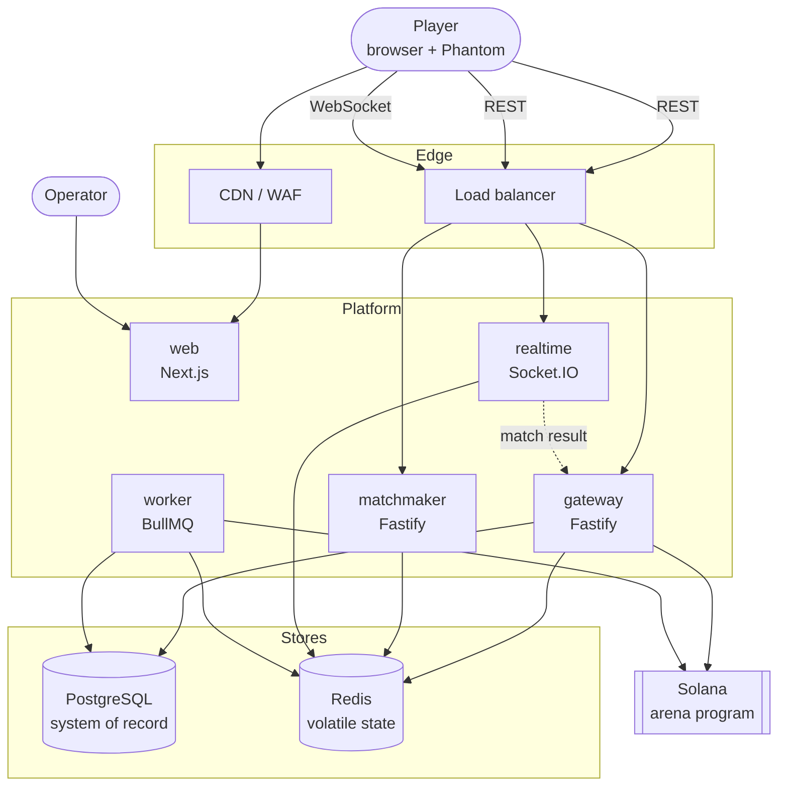
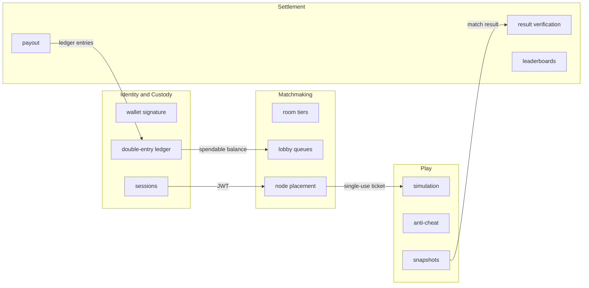
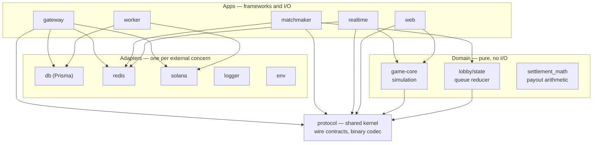

# Architecture

## System context

Five deployable units. The split is not by layer — it is by **failure domain and
scaling axis**, which is the only split that earns its operational cost:

| Service      | Scales on     | State               | If it dies                                           |
| ------------ | ------------- | ------------------- | ---------------------------------------------------- |
| `web`        | CDN edge      | none                | site down, live games continue                       |
| `gateway`    | request rate  | none                | no sign-in, deposits or history; live games continue |
| `matchmaker` | poll rate     | none (Redis)        | no new joins; live games continue                    |
| `realtime`   | tick headroom | **rooms in memory** | those rooms end; others unaffected                   |
| `worker`     | queue depth   | none                | settlement backs up, recovers on restart             |

Only `realtime` is stateful, and its state is deliberately scoped to one
process — see [The room never spans a process](#the-room-never-spans-a-process).

## Bounded contexts

Four contexts, mapped onto services rather than onto layers. Each owns its data
and publishes a contract; none reaches into another's tables.

Those arrows are the only couplings, and each is a **published contract** in
`@arena/protocol` rather than a shared table. The ticket is the clearest case:
Matchmaking hands Play a signed capability naming one room on one node, so Play
never queries the lobby and Matchmaking never learns what happens in a match.

### Ubiquitous language

These terms mean one thing everywhere — in code, in the database, and in these
docs. Where an obvious synonym exists it is deliberately _not_ used.

| Term             | Means                                                     | Not                     |
| ---------------- | --------------------------------------------------------- | ----------------------- |
| **Room**         | A durable arena configuration: entry fee, rake, capacity  | a live match            |
| **Game**         | One played instance of a room, with a settlement outcome  | a room                  |
| **Lobby**        | The volatile queue of players waiting for a room          | a room or a game        |
| **Seat**         | A player's slot in a live room, held through a disconnect | a connection            |
| **Ticket**       | Single-use capability to enter one room on one node       | a session token         |
| **Pool account** | A balance in the double-entry ledger                      | a wallet                |
| **Custody**      | Lamports the platform holds _for_ a player                | the player's own wallet |
| **Entry group**  | The legs forming one transfer; they sum to zero           | a transaction           |

## The dependency rule

Dependencies point **inward only**. Nothing in `packages/` imports from `apps/`,
and the domain packages import no infrastructure at all — `game-core` reaches
for `@arena/protocol` types and nothing else, which is why the whole simulation
runs in a unit test with no database, no socket and no clock.

`protocol` sits outside the layering as a **shared kernel**: the wire format both
the browser and the server compile against. It is the one package everything may
depend on, and it earns that by holding only types, schemas and a binary codec —
no behaviour that could diverge between consumers.

## Where this follows Clean Architecture, and where it does not

Applying a pattern where it does not pay is as much a mistake as omitting it
where it does. Each deviation below is deliberate and listed with its cost.

**Where the pattern holds:**

- **`game-core` is a genuine domain layer.** Pure, deterministic, seeded RNG, no
  ambient clock. The same inputs always produce the same world, which is what
  makes replay-based dispute resolution possible at all.
- **`packages/lobby` is hexagonal internally.** `state.ts` is a pure reducer
  (domain), `store.ts` is a port, `redis-store.ts` an adapter, `service.ts` the
  application service. The package depends on `@arena/redis` only because the
  adapter ships beside the port; the domain half imports nothing.
- **`settlement_math.rs` is the same idea on-chain.** The arithmetic is
  extracted from the instruction, unit tested without a validator, and the
  instruction calls it — not a copy of it.
- **Invariants live where they are enforced.** Idempotency is a unique index,
  not an `if`; the ledger balances because legs sum to zero in SQL. Moving those
  into a domain service moves them somewhere two concurrent requests can both
  pass.

**Where it deliberately does not:**

- **Route handlers hold application logic** rather than delegating to a use-case
  object per endpoint. Thirty endpoints would mean thirty classes whose bodies
  are the handler body. _Cost:_ use cases are not independently unit testable —
  mitigated by integration tests that drive the real HTTP path, which is what
  would break anyway.
- **`Room` mixes domain state with Socket.IO emission.** Splitting needs an
  event bus inside a process that owns exactly one transport. _Cost:_ `Room` is
  only testable with a socket stub — which its tests use, cheaply.
- **Prisma models are used directly, with no domain-entity mapping.** For
  fifteen tables the mapper is near-identity. _Cost:_ the persistence shape leaks
  into services; if a second persistence technology ever appears, this is the
  layer that must be introduced first. None has, so it has not been.

The rule applied throughout: **abstract when there is a second implementation or
a real seam, not in anticipation of one.** `store.ts` exists because the lobby
genuinely has two stores — in-memory for tests, Redis for production. A
`UserRepository` interface would have exactly one implementation forever.

## Key design decisions

### The room never spans a process

One room lives entirely inside one `realtime` process. Every player in it shares
a tick loop, a world and a memory space.

The alternative — sharding a room across processes — needs a distributed lock on
every collision check. At 30 Hz that is a lock round trip per tick per pair,
slower than the simulation it protects. Confining a room removes the problem
outright: **the room is the unit of sharding**, and a node holds as many as its
tick headroom allows.

Consequence: a node dying ends its rooms. Accepted deliberately — the blast
radius is bounded to those matches, where the alternative buys availability at
the cost of every match being slow all the time.

### The client predicts, the server decides

The client simulates locally so movement feels instant, then reconciles against
authoritative snapshots. Both sides share `@arena/game-core` — literally the same
module — so prediction and authority cannot drift through a reimplementation.

The client is never trusted. It sends _intent_ (a heading, a boost flag); the
server produces _outcome_. Positions, scores and kills travel server → client
only.

### Money is double-entry, in the database

Every movement of value is legs that sum to zero, and player balances are
`USER_CUSTODY` pool accounts rather than a column on `users`.

That is what makes the invariant `SUM(pool balances) == SUM(posted entries)`
checkable at all. A balance column would sit outside the ledger and could drift
with nothing able to detect it — and "the numbers are wrong and we cannot tell
when they went wrong" is the failure that ends a custody platform.

### Amounts cross the wire as decimal strings

Above roughly 9M SOL a lamport count exceeds `Number.MAX_SAFE_INTEGER`, and JSON
has no bigint. A client parsing these as numbers corrupts balances silently,
which is the worst way for a money bug to behave.

### Protocol versioning is enforced at the handshake

A client on a different major version is refused with `PROTOCOL_MISMATCH` rather
than allowed to desync quietly. A stale browser tab after a deploy is the common
case, and it should reconnect rather than render a divergent world.

### Expand/contract for database changes

Schema changes ship in two deploys: add the new shape and backfill, then remove
the old one once no running instance references it. A single destructive
migration is a guaranteed error window during any rolling deploy, because two
versions of the code are live simultaneously by construction.

## Further reading

- [SEQUENCES.md](SEQUENCES.md) — how the pieces interact, flow by flow
- [DATA-MODEL.md](DATA-MODEL.md) — every table, index and relation
- [ONCHAIN.md](ONCHAIN.md) — the Anchor program and its guarantees
- [API.md](API.md) — REST surface and conventions
- [NETWORKING.md](NETWORKING.md) — wire protocol, prediction, interpolation
- [SECURITY.md](SECURITY.md) — the nine defensive layers
- [SCALING.md](SCALING.md) — capacity model and bottleneck analysis
- [DEPLOYMENT.md](DEPLOYMENT.md) — environments, rollout, rollback
- [TESTING.md](TESTING.md) — the six test layers
