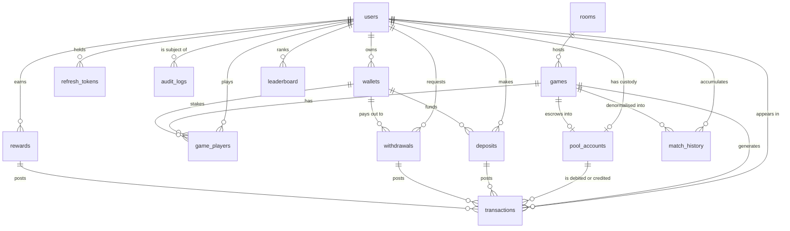

# Data model

Schema: [`packages/db/prisma/schema.prisma`](../packages/db/prisma/schema.prisma)
Initial migration: `packages/db/prisma/migrations/20260730120000_init/migration.sql`

15 tables, 22 enums, 63 explicit indexes, 29 foreign keys.

---

## Conventions

**Money is `BigInt` lamports.** Never a float. A rounding error in a ledger is
unrecoverable, and lamports are integers by definition, so there is no reason to
reach for a decimal type.

**snake_case in the database, camelCase in Prisma.** Every model uses `@map` /
`@@map`. SQL stays idiomatic; TypeScript stays idiomatic.

**Idempotency is a database constraint, not application logic.** Anything
triggerable from outside — a deposit webhook, a settlement retry, a daily bonus
grant — carries an `idempotencyKey` with a `UNIQUE` index. Application checks
race; a unique index does not.

**Append-only where it matters.** `transactions` and `match_history` are never
updated or deleted. A mistake is corrected by writing a compensating row, which
is what makes the history auditable.

**Nothing here is on the hot game loop.** Live state lives in the realtime
node's memory, coordinated through Redis. Rows land here asynchronously when a
game ends. A slow database must never be able to stall a running match.

---

## Entity relationships

Reading it: **everything to do with money converges on `transactions`.** That
table is the ledger, and a movement of value that does not land there did not
happen as far as the platform is concerned.

`pool_accounts` relates to both `users` and `games` because one table serves
both roles — a player's custody balance and a game's escrow are the same kind of
thing, and making them the same table is what lets a single `SUM` check the
whole system.

`leaderboard` and `match_history` are **read models**: derived, rebuildable, and
deliberately denormalised. Losing them costs a background job, not data.

---

## Identity

### `users`

The account. One row per person.

Deliberately **separate from `wallets`**. A player may connect a hardware wallet
for withdrawals and a hot wallet for play; both must resolve to one identity,
one balance, and one leaderboard entry. Collapsing user and wallet into one
table makes multi-wallet support a migration rather than a feature.

Carries denormalised aggregates (`gamesPlayed`, `wins`, `bestScore`,
`lifetimeWagered`, …). These are maintained by a background job, never on the
write path — incrementing a counter on the user row at the end of every match
would serialise every game behind a row lock on the most contended table.

`deletedAt` is a soft delete. Financial history must survive account closure,
so the row is never physically removed.

| Index               | Serves                       |
| ------------------- | ---------------------------- |
| `username` unique   | handle lookup and uniqueness |
| `last_seen_at DESC` | active-player queries        |
| `best_score DESC`   | all-time ranking fallback    |
| `status`            | moderation sweeps            |

### `wallets`

A blockchain address proven to belong to a user by an ed25519 signature.

`address` is **globally unique** — one address, exactly one owner. Without that
constraint two accounts could claim the same wallet and both try to withdraw to
it.

`verifiedAt` is null until the signature challenge succeeds. An unverified
wallet must never receive a withdrawal; that check is the whole point of the
column.

`isPrimary` marks the default payout destination. One primary per user is
currently enforced in application code — Prisma cannot express a partial unique
index. The exact SQL is noted as a TODO in the schema:
`CREATE UNIQUE INDEX wallets_one_primary ON wallets (user_id) WHERE is_primary;`

---

## Gameplay

### `rooms`

A configured arena: mode, region, capacity, entry fee, rake.

A room is **long-lived and outlives the games played inside it**. That is what
lets a private room keep a stable join code across many matches, and lets
analytics group results by arena configuration rather than by individual match.

`nodeId` records which realtime process currently hosts the room — the same
pinning the matchmaker relies on when it hands a client a specific node address.

The composite index `(status, visibility, region, mode)` exists for exactly one
query: the lobby's "open public rooms in my region for this mode".

### `games`

One match inside a room. Append-only, and the parent of every financial record
the match produces.

`seed` is stored so a match can be deterministically replayed from recorded
inputs when a result is disputed — the simulation is seeded and deterministic
precisely so this is possible.

Settlement state lives here (`settlementStatus`, `settlementSignature`,
`settlementAttempts`, `settlementError`) rather than in a separate table,
because settlement is one-to-one with a game and splitting it would mean a join
on every payout query. `settlementSignature` is unique: the same on-chain
transaction can never be recorded against two games.

The `(settlementStatus, endedAt)` index drives the retry worker that finds
payouts stuck in `PENDING` or `FAILED`.

Highest-volume table alongside `game_players`; `startedAt` is the intended
range-partition key.

### `game_players`

One user's participation in one game — the join record and the result.

`@@unique([gameId, userId])` is the constraint that makes a retried join
idempotent instead of charging a second entry fee.

`walletId` pins which wallet staked at join time. Without it, a player changing
their primary wallet mid-match could redirect an in-flight payout.

`killedById` is a self-referencing nullable FK. Nullable because a wall death or
a disconnect has no killer; self-referencing because a killer is another
participant in the same game, which gives kill-feed and revenge queries for free.

---

## Money

The four money tables form a closed system. `pool_accounts` holds balances,
`transactions` is the immutable ledger explaining every balance, and
`deposits` / `withdrawals` are the lifecycles that bridge on-chain events into
ledger entries.

### `pool_accounts`

A named balance the platform controls.

Every lamport sits in exactly one pool account — **including each user's own
balance**, which is a `USER_CUSTODY` pool rather than a column on `users`.

That choice is what makes the ledger provable: the sum of all pool balances must
equal the sum of all posted transactions, and a cron job can assert that
invariant. If user balances lived on the `users` table they would be outside the
ledger and could silently drift.

| Kind           | Purpose                                                 |
| -------------- | ------------------------------------------------------- |
| `USER_CUSTODY` | one per user; their spendable balance                   |
| `GAME_ESCROW`  | one per wagered game; holds entry fees until settlement |
| `TREASURY`     | house funds                                             |
| `RAKE`         | accumulated fees, swept to treasury                     |
| `REWARDS`      | funds earmarked for bonuses                             |

`reservedLamports` separates committed from spendable funds. Spendable is
`balance - reserved`, which is what stops a player wagering the same lamports in
two rooms simultaneously.

`version` is an optimistic-locking counter. Every balance write bumps it and
asserts the prior value, so two concurrent settlements cannot both
read-modify-write and lose one update.

`gameId` and `ownerUserId` are both unique — one escrow per game, one custody
account per user.

### `transactions`

The immutable double-entry ledger. Every movement of value is a row.

Rows are **never updated or deleted**. A mistake is corrected by posting a
compensating entry, so the history always explains the current balance.

`entryGroupId` ties together the legs of one logical transfer. A payout writes
two rows sharing a group id: a `DEBIT` against the game escrow and a `CREDIT` to
the winner's custody account. **The legs in a group must sum to zero** — that is
the invariant that makes the books balance, and it is verified in the schema
tests.

`balanceAfterLamports` snapshots the pool balance immediately after the entry,
so an auditor can inspect any point in history without replaying every prior row.

`idempotencyKey` is unique. A duplicated settlement message hits the constraint
instead of paying twice.

Exactly one of `gameId` / `depositId` / `withdrawalId` / `rewardId` is set,
recording what caused the entry.

### `deposits`

An on-chain transfer into the platform.

Separate from `transactions` because a deposit has a **lifecycle before it
becomes money**: it is observed on chain, waits for confirmations, and only then
posts a ledger entry. Treating it as a ledger row from the start would credit
funds that might never confirm.

`txSignature` is unique — the same on-chain transfer can never be credited
twice. This is the single most important constraint in the table.

The `(status, createdAt)` index drives the confirmation poller.

### `withdrawals`

An outbound transfer to a user's wallet.

Kept distinct from `deposits` because the **risk profile is inverted**: deposits
are safe to process automatically, withdrawals move money out and may need
manual review. Hence `PENDING_REVIEW`, `reviewedById` and `reviewNote`, which
have no deposit equivalent.

`reviewedById` is a second FK to `users` — an admin, not the owner — which is
why `users` has two named relations to this table.

Destination must be a **verified** wallet; the `verifiedAt` check on `wallets`
is enforced in application code before approval.

### `rewards`

A grant of value that did not come from a deposit: daily bonuses, referral
credit, tournament prizes, achievements, support compensation.

Modelled with its own lifecycle rather than as a bare ledger entry because a
reward can be granted now and claimed later, or expire unclaimed. A ledger row
cannot express "granted but not yet claimed".

`idempotencyKey` encodes the user and period — e.g. `daily:<userId>:2026-07-30`
— so the daily bonus job is safe to run twice.

---

## Read models

These two tables store nothing that could not be derived. They exist because the
derivation is too expensive at read time.

### `leaderboard`

Materialised ranking snapshots.

The **live** board is a Redis sorted set; a global `ORDER BY` over
`game_players` cannot hold up at this scale. This table is the durable periodic
snapshot. It survives a Redis flush, answers "what was my rank on 12 March",
and is the source of truth when prizes are paid against a closed period.

Keyed by `(window, periodKey, userId)` — window is the granularity (`DAILY`,
`WEEKLY`, `MONTHLY`, `ALL_TIME`, `SEASON`), `periodKey` identifies the instance
(`2026-07-30`, `2026-W31`, `all`). Recomputation is an upsert on that key.

`finalized` flips true when the period closes and the ranking will not change.

> The column is mapped to `window_type`: `window` is a **reserved word in
> PostgreSQL**. Prisma quotes identifiers so it would have worked, but every
> hand-written query and psql session would have needed quoting too. This was
> caught by executing the migration against a real Postgres engine.

### `match_history`

Denormalised per-user game log.

Every column is derivable by joining `games`, `game_players` and `rooms`. It
exists because the profile page is one of the most requested views in the
product, and a three-table join ordered by time over hundreds of millions of
rows is exactly the query that falls over first.

`mode` and `region` are copied from the room so the history view needs no join
at all. `netLamports` is stored as `payout - entry` so profit/loss charts avoid
per-row arithmetic.

`@@unique([userId, gameId])` makes the projection idempotent — replaying the
writer cannot duplicate rows.

Written once when a game completes; never updated.

---

## Supporting

### `stake_reservations`

A player's committed entry fee for a room they have queued for.

| Column     | Notes                                                                            |
| ---------- | -------------------------------------------------------------------------------- |
| `user_id`  | Cascades on delete — a reservation is a live commitment, not history             |
| `tier_id`  | Room tier (`gold`), not a `rooms.id`: a player queues before the game row exists |
| `lamports` | The fee, copied at reserve time so a later price change cannot alter it          |

**`@@unique([user_id, tier_id])`** is what makes a double-clicked join idempotent
rather than charging twice. Enforced by the index, not an `if` — two concurrent
joins would otherwise both read "not yet staked" and both insert.

The reserved lamports stay in the player's `pool_accounts` row; only
`reserved_lamports` moves. That is what stops one balance staking three rooms,
and what lets a withdrawal check `balance - reserved` instead of racing a match
that is about to start.

Rows leave in one of two ways, and confusing them would double-pay or
double-charge:

- **Release** — the player left. `reserved_lamports` goes back down, the balance
  is untouched.
- **Consume** — the match started and the stake is locked into the room vault.
  Both `balance_lamports` and `reserved_lamports` go down.

### `refresh_tokens`

Refresh-token family for rotation and theft detection. Only a SHA-256 hash is
stored — never the token. Presenting an already-rotated token means either a
race or theft; the safe interpretation is theft, so the whole `familyId` is
revoked. The access token is a stateless JWT and is not stored at all.

### `skins`

Cosmetic reference data. `collectionMint` gates a skin behind ownership of a
Metaplex NFT collection.

### `audit_logs`

Append-only trail for anti-cheat signals, moderation actions and manual
financial adjustments. `userId` is the subject, `actorId` is who acted — for a
ban those differ, and both matter. `BigInt` autoincrement id because this table
grows faster than anything except the ledger.

---

## Operational notes

**Partitioning.** `games`, `game_players`, `transactions` and `match_history`
are append-only and time-ordered. Range-partition by `startedAt` / `joinedAt` /
`createdAt` / `playedAt` once volume justifies it. Do it before the tables get
large, not after.

**Connection pooling.** Runtime traffic goes through PgBouncer in transaction
mode (`DATABASE_URL`). Migrations use `DIRECT_DATABASE_URL` because they need
session-level features transaction pooling does not support.

**Migrations are expand/contract.** Realtime nodes drain over minutes, so old
and new code run concurrently during a rollout. Add nullable columns, backfill,
switch reads, then drop in a _later_ release. Never rename in place. See
[OPERATIONS.md](OPERATIONS.md).

**Reconciliation job (TODO).** Assert `SUM(pool_accounts.balance_lamports)`
equals the net of all `POSTED` transactions, and that every `entryGroupId` sums
to zero. Alert on any drift — that is the tripwire for a ledger bug.
