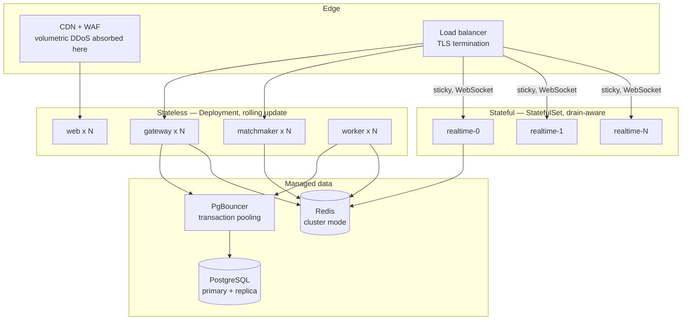
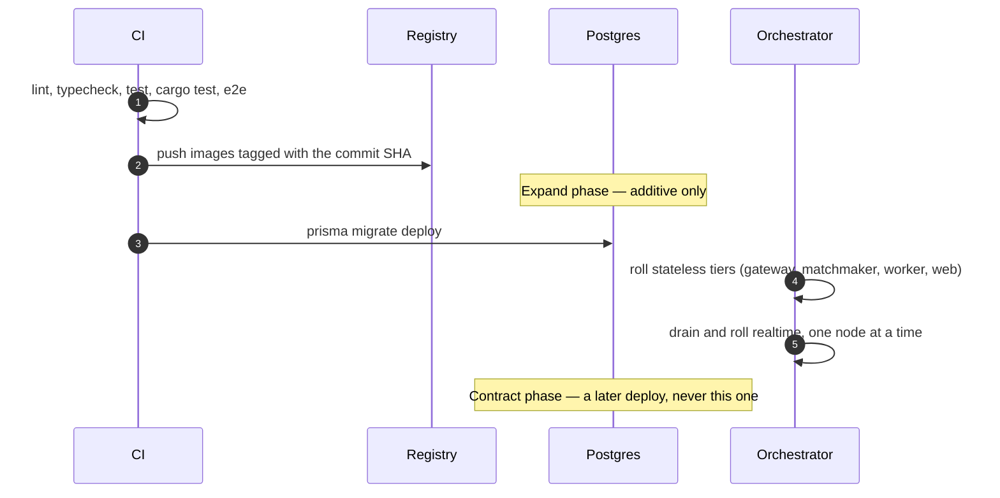

# Deployment

Environments, secrets, rollout and rollback. Day-two runbooks — draining a node,
chasing stuck settlement — live in [OPERATIONS.md](OPERATIONS.md).

## Topology



The only structurally interesting part is `realtime`. It holds authoritative
world state in process memory, so it needs stable addressing, session affinity
at the load balancer, and a rollout that drains rather than kills. Everything
else is a stateless Deployment and can be replaced at will.

## Environments

|               | Local   | Staging            | Production                  |
| ------------- | ------- | ------------------ | --------------------------- |
| Solana        | devnet  | devnet             | mainnet-beta                |
| Postgres      | Docker  | managed, 1 replica | managed, HA + PITR          |
| Redis         | Docker  | single             | cluster mode                |
| `NODE_ENV`    | unset   | `production`       | `production`                |
| Swagger UI    | on      | on                 | **off** (JSON still served) |
| `TRUST_PROXY` | `false` | `true`             | `true`                      |

`NODE_ENV` is deliberately **absent** from `.env.example`. Setting it to
`development` there leaks into `next build` and produces a development bundle in
a production image — the runtime owns this variable, not the env file.

`TRUST_PROXY` must be `false` unless genuinely behind a proxy. When it is true,
the client IP is read from `X-Forwarded-For`, and with nothing rewriting that
header a client simply declares its own address and bypasses every IP-keyed rate
limit.

## Configuration

Every variable is declared in a Zod schema under
[`packages/env`](../packages/env) and validated at boot. A misconfigured deploy
fails immediately with every problem listed, rather than a null-pointer at the
first request that needs the missing value.

```bash
pnpm env:check   # validates .env against all four service schemas
```

`.env.example` is the reference. Three things worth internalising:

- **`NEXT_PUBLIC_*` values are inlined into the browser bundle at build time.**
  They are public by definition, and changing one requires a rebuild — not a
  restart.
- **`DIRECT_DATABASE_URL` must bypass PgBouncer.** Prisma migrations use
  session-level features that transaction pooling does not support. The runtime
  URL goes through the pooler; the migration URL does not.
- **`JWT_SECRET` is also the salt for audit-log IP hashes.** Rotating it
  invalidates every live session (intended) and makes historical IP hashes
  incomparable with new ones (worth knowing before an incident).

### Secrets

| Secret                       | Held by                       | Rotation                                         |
| ---------------------------- | ----------------------------- | ------------------------------------------------ |
| `JWT_SECRET`                 | gateway, matchmaker, realtime | Logs everyone out; roll during a quiet window    |
| `DATABASE_URL`               | gateway, worker               | Standard credential rotation                     |
| Settlement authority keypair | worker                        | `update_config` on chain, **no program upgrade** |

The settlement authority is a hot key by necessity — it signs payouts
automatically. It is rotatable through `update_config` precisely because a hot
key will eventually need rotating, and needing a program upgrade to do it would
mean not doing it.

Never commit any of these. `.env.example` contains placeholders only, and
`packages/logger` redacts tokens, signatures, keypairs and auth headers at the
Pino level rather than per call site — wallet auth means signatures flow through
request bodies routinely, and one unredacted log line in an aggregator is a
durable leak.

## Rollout



### Migrations are expand/contract, always

Ship schema changes in two deploys:

1. **Expand** — add the column, backfill it, write to both shapes. Old code
   still works.
2. **Contract** — a _later_ deploy removes the old shape, once nothing running
   references it.

A single destructive migration is a guaranteed error window during any rolling
deploy, because two versions of the code are live simultaneously by
construction. This is not caution; it is arithmetic.

`pnpm db:deploy` runs `prisma migrate deploy`, which applies pending migrations
and never generates them. Generating happens in development, is reviewed as a
diff, and is what CI replays from empty in the `migrations` job.

### Draining a realtime node

```bash
kubectl exec realtime-3 -- kill -TERM 1
```

On `SIGTERM` a node stops accepting placements, emits `Migrate` to connected
clients, waits `DRAIN_TIMEOUT_SECONDS`, then exits. Clients re-matchmake and
land elsewhere.

Set `terminationGracePeriodSeconds` above `DRAIN_TIMEOUT_SECONDS`. If it is
lower, the orchestrator `SIGKILL`s mid-drain and the matches that were being
handed over end abruptly instead — which is the exact outcome draining exists to
avoid.

### Health endpoints

| Endpoint        | Answers                          | Touches dependencies |
| --------------- | -------------------------------- | -------------------- |
| `/health/live`  | Is the process wedged?           | **No**               |
| `/health/ready` | Should this replica get traffic? | Yes                  |

Liveness must not check downstream systems. A Redis blip that fails liveness
restarts every pod simultaneously, converting a dependency hiccup into a total
outage. Readiness is where dependency checks belong, because failing it removes
one replica from rotation rather than killing it.

Both are excluded from rate limiting. A throttled liveness probe restarts the
pod, turning a traffic spike into an outage.

## Capacity

From [TESTING.md](TESTING.md), measured on an unloaded dev machine:

| Scenario                  | Per tick    | 30 Hz budget |
| ------------------------- | ----------- | ------------ |
| 120 players, one room     | 1.34 ms     | 4.0%         |
| **40 rooms × 30 players** | **24.2 ms** | **72.5%**    |

`MAX_ROOMS_PER_NODE=40` leaves roughly a quarter of the budget spare _before_
Socket.IO serialisation and snapshot fan-out, which share the same event loop.
Treat the default as a ceiling to measure against real hardware, not a target.

Autoscale `realtime` on **tick headroom** (`arena_tick_duration_seconds`), not
CPU. A node can sit at 60% CPU and still miss ticks because one room got dense,
and CPU utilisation will not tell you that.

Placement uses **best-fit**, not least-loaded: least-loaded spreads players
evenly across every node, which keeps them all half full and means none can ever
be reclaimed.

## Rollback

| Situation                     | Action                                             |
| ----------------------------- | -------------------------------------------------- |
| Bad application deploy        | Redeploy the previous image tag                    |
| Bad migration, expand phase   | Roll back code; the additive migration is harmless |
| Bad migration, contract phase | **Restore from PITR** — the old shape is gone      |
| Bad program upgrade           | Not rollback-able; deploy a fixed version          |

The asymmetry is the reason for expand/contract. An expand migration is always
safe to leave in place, so a code rollback is a one-step operation. A contract
migration has destroyed information, and the only recovery is a restore.

On-chain, `cancel_room` is the escape hatch: it opens refunds and is
permissionless after the delay, so a program bug that blocks settlement does not
strand player funds indefinitely.

## Backups

- Postgres: automated daily snapshots plus continuous WAL archiving. The RPO
  that matters is the ledger, and it is append-only, so PITR reconstructs it
  exactly.
- Redis: **not backed up, deliberately.** Everything in it is either
  reconstructible (node registry, lobby queues) or short-lived (nonces,
  tickets). Restoring stale lobby state would be actively worse than an empty
  one.
- Restores are only real if rehearsed. Practise on staging.

## Docker

```bash
pnpm docker:up      # Postgres, PgBouncer, Redis
pnpm docker:build   # production images
```

Images are multi-stage: a builder installs the full workspace and compiles, then
a slim runtime stage copies only `dist` and production dependencies. Each
service gets its own image, so `realtime` does not ship Prisma and `worker` does
not ship PixiJS.

**Not verified:** Docker is not installed in this environment. The compose files
and Dockerfiles are unbuilt and unrun.
