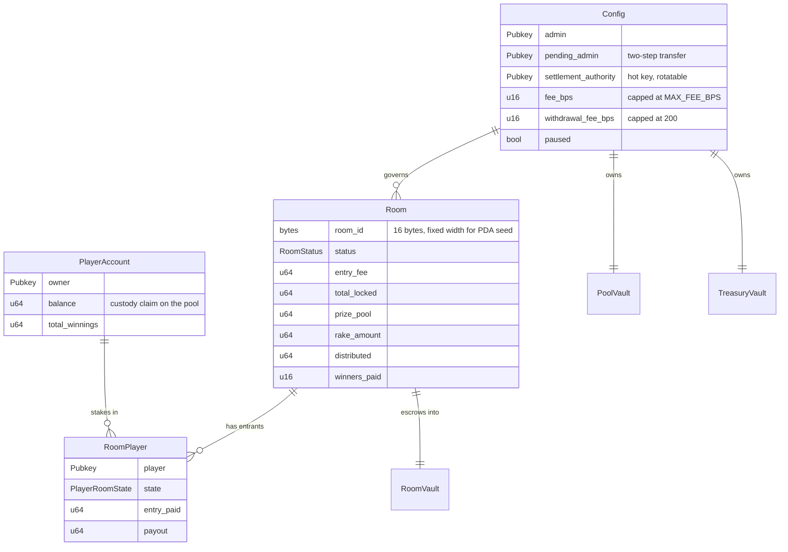
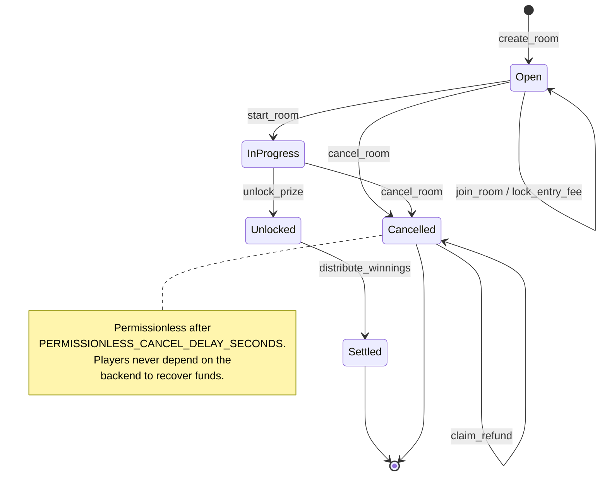

# Smart contract

Anchor program at [`programs/programs/arena/src`](../programs/programs/arena/src),
client SDK at [`packages/solana/src`](../packages/solana/src).

## Scope: what is on chain, and what is not

| On chain                                 | Off chain                      |
| ---------------------------------------- | ------------------------------ |
| Custody of lamports                      | Player movement and collisions |
| Entry-fee escrow per room                | Who won and by how much        |
| Payout, capped by the escrowed pot       | Leaderboards, match history    |
| Rake, capped at 10%                      | Rate limiting, anti-cheat      |
| Permissionless refund after cancellation | Session tokens                 |

Gameplay is simulated off chain because putting 30 Hz movement on chain is
neither fast enough nor affordable. That means **the backend is trusted to
report who won** — and the program's job is to bound what that trust can cost.

The bound is precise: a compromised backend can _misallocate_ a pot among
players. It cannot mint lamports, skim one, pay a pot twice, or raise the rake.
Those four are structural, not procedural — see [Guarantees](#guarantees).

## Account model



Two kinds of account, and conflating them is the classic source of
"instruction failed" with no useful message:

- **Vaults** (`pool`, `treasury`, `room_vault`) are PDAs holding lamports with
  **no data**, so they remain System-owned and lamports move out via a signed
  System Program CPI.
- **Data accounts** (`Config`, `Room`, `RoomPlayer`, `PlayerAccount`) are owned
  by this program. The System Program refuses to debit them, so they would need
  direct lamport arithmetic. This program never moves lamports out of a data
  account, which keeps that whole bug class out of scope.

### PDA seeds

Mirrored in [`packages/solana/src/pda.ts`](../packages/solana/src/pda.ts). If
they drift, every instruction fails a constraint — so they change together.

| Account         | Seeds                           |
| --------------- | ------------------------------- |
| `Config`        | `["config"]`                    |
| Pool vault      | `["pool"]`                      |
| Treasury vault  | `["treasury"]`                  |
| `PlayerAccount` | `["player", owner]`             |
| `Room`          | `["room", room_id]`             |
| Room vault      | `["room_vault", room_id]`       |
| `RoomPlayer`    | `["room_player", room, player]` |

`room_id` is a fixed 16 bytes rather than a string precisely so it can be a seed
directly, with no length-prefix ambiguity.

## Instruction set

Fourteen instructions in four groups.

### Admin

| Instruction         | Authority     | Notes                                         |
| ------------------- | ------------- | --------------------------------------------- |
| `initialize`        | deployer      | One-time. Creates `Config` and both vaults.   |
| `update_config`     | admin         | Fee changes re-checked against the caps.      |
| `transfer_admin`    | admin         | Sets `pending_admin` — does **not** transfer. |
| `accept_admin`      | pending admin | Completes the handover.                       |
| `withdraw_treasury` | admin         | House funds only; cannot touch the pool.      |

Admin transfer is two-step because a one-step transfer to a mistyped address is
unrecoverable and permanent. The pending address must actively claim it.

### Custody

| Instruction | Authority | Notes                                                 |
| ----------- | --------- | ----------------------------------------------------- |
| `deposit`   | player    | Wallet → pool vault, credits `PlayerAccount.balance`. |
| `withdraw`  | player    | Pool vault → wallet, minus `withdrawal_fee_bps`.      |

The withdrawal fee is capped at 200 bps against 1000 for the room rake, and the
asymmetry is deliberate: a rake is taken once from a pot the player chose to
enter, whereas a withdrawal fee is charged on the player's own money on the way
out. A high one is indistinguishable from an exit tax.

### Room lifecycle

| Instruction      | Authority            | Notes                                                |
| ---------------- | -------------------- | ---------------------------------------------------- |
| `create_room`    | settlement authority | Fixes entry fee, capacity and rake at creation.      |
| `join_room`      | player               | Creates `RoomPlayer` in `Joined`.                    |
| `lock_entry_fee` | player               | Moves the fee into the room vault; state → `Locked`. |
| `start_room`     | settlement authority | `Open` → `InProgress`. No further joins.             |

Terms are fixed at creation and never editable. Repricing a room players have
already staked into changes the deal they agreed to; the honest operation is to
close it and open a new one, which leaves the old terms visible in history.

### Settlement

| Instruction           | Authority                          | Notes                                                    |
| --------------------- | ---------------------------------- | -------------------------------------------------------- |
| `unlock_prize`        | settlement authority               | `InProgress` → `Unlocked`, computes rake and prize pool. |
| `distribute_winnings` | settlement authority               | Pays winners; state → `Settled`.                         |
| `cancel_room`         | admin, **or anyone after a delay** | Opens refunds.                                           |
| `claim_refund`        | player                             | Returns the staked entry fee.                            |



The permissionless cancel path is the players' escape hatch. Without it,
escrowed funds are recoverable only if the backend chooses to act — exactly the
dependency an on-chain escrow exists to remove.

## Guarantees

Each is enforced structurally, and each has a test.

### 1. Payouts sum to the prize pool, exactly

```rust
let total_payout = validate_payouts(&payouts, ctx.accounts.room.prize_pool)?;
```

[`settlement_math::validate_payouts`](../programs/programs/arena/src/settlement_math.rs)
rejects an empty list, a zero entry, more winners than one call can pay, an
overflowing sum, and any total that is not equal to `prize_pool`. Not `<=` —
equal. Under-paying strands the remainder in a vault no instruction can release.

### 2. A room settles at most once

`status` flips to `Settled` before any transfer, and `distribute_winnings`
requires `Unlocked`. A re-entrant or retried call finds the wrong state and
aborts.

### 3. The platform fee goes straight to the owner's wallet

`distribute_winnings` transfers the fee to `config.fee_destination` — an
ordinary wallet, not a program vault. Routing it through the treasury PDA would
mean the owner has to run a second transaction to collect their own revenue, and
leaves the money program-held in the meantime. The account is constrained
against config, so a caller cannot substitute their own address.

### 4. The rake is capped, and rounds down

`MAX_FEE_BPS` is 1000 (10%) and is a **constant**, not config — raising it needs
a program upgrade, not an admin key. `split_pot` re-checks the cap rather than
trusting the stored value, so a compromised admin key still cannot drain a pot.

Integer division truncates, so the rake rounds **down** and the remainder stays
with the players. Rounding the house's cut up would take a lamport from every
pot on the platform, and "a rounding error in the house's favour" is a phrase
that ends up in a regulator's report.

### 5. No winner is paid twice in one call

Two `RoomPlayer` accounts resolving to the same player would double-credit them
while still summing to the pot. `distribute_winnings` tracks seen pubkeys and
rejects duplicates.

### 6. Account substitution is impossible

Ownership and discriminator checks prove an account is _a_ `RoomPlayer`; they do
not prove it is _this room's_ record for _this_ player. Both addresses are
re-derived with `create_program_address` and compared.

### 7. A vault is never drained below rent exemption

A vault emptied to zero is garbage-collected, and the next deposit would land in
a freshly created account — silently losing the association.

## Errors

38 variants in [`errors.rs`](../programs/programs/arena/src/errors.rs), numbered
from 6000 by Anchor convention and mirrored in
[`packages/solana/src/constants.ts`](../packages/solana/src/constants.ts) so the
SDK can map a chain error to a typed one instead of a string.

Notable ones and what they actually mean:

| Error                     | Cause                                                 |
| ------------------------- | ----------------------------------------------------- |
| `PayoutMismatch`          | The payout total does not equal the prize pool        |
| `PrizeNotUnlocked`        | `distribute_winnings` before `unlock_prize`           |
| `DuplicateWinner`         | The same player appears twice in one distribution     |
| `FeeTooHigh`              | A fee above `MAX_FEE_BPS` or `MAX_WITHDRAWAL_FEE_BPS` |
| `EntryFeeNotLocked`       | Paying a player who never staked                      |
| `WouldBreakRentExemption` | A transfer would garbage-collect a vault              |
| `RoomPlayerMismatch`      | A substituted `RoomPlayer` account                    |

## Events

Sixteen events, emitted on every state transition that moves value or changes
authority. They are the indexing surface — the off-chain reconciler reads them
rather than diffing account state, because an event carries _what happened_
while a diff only shows _what is now true_.

`ProgramInitialized`, `ConfigUpdated`, `AdminTransferInitiated`,
`AdminTransferAccepted`, `Deposited`, `Withdrawn`, `RoomCreated`, `RoomStarted`,
`PlayerJoined`, `EntryFeeLocked`, `PrizeUnlocked`, `WinnerPaid`,
`WinningsDistributed`, `RoomCancelled`, `RefundClaimed`, `TreasuryWithdrawn`.

## Client SDK

[`packages/solana`](../packages/solana) wraps the program for Node and the
browser.

| Module                  | Responsibility                                               |
| ----------------------- | ------------------------------------------------------------ |
| `pda.ts`                | Seed derivation, mirroring `constants.rs`                    |
| `instructions.ts`       | Hand-encoded instruction data                                |
| `service.ts`            | `ArenaService` — the high-level API                          |
| `connection.ts`         | `RpcPool` with failover                                      |
| `tx/retry.ts`           | Exponential backoff, jittered, non-retryable errors excluded |
| `tx/circuit-breaker.ts` | Stops retry amplifying an RPC outage                         |
| `tx/confirm.ts`         | Confirmation with commitment levels                          |
| `tx/parse.ts`           | Transaction → typed result                                   |
| `auth/message.ts`       | The exact string a wallet signs                              |
| `auth/verify.ts`        | ed25519 verification                                         |

Program errors are **not** retried: they are deterministic, so a retry produces
the same rejection while consuming rate-limit budget. Only transport failures
are.

## Running it

```bash
pnpm test:contract       # cargo test — 26 unit tests, no validator needed
pnpm anchor:build        # cargo build-sbf
pnpm anchor:test         # anchor test — needs solana-test-validator
pnpm anchor:deploy       # devnet
```

## Verification status

**Verified here:** `cargo test` (26), `cargo clippy` (zero warnings),
`cargo fmt --check`, and `cargo check` against the host target.

**Not verified:** the program has never been built for SBF or executed. There is
no Solana toolchain in this environment, so `anchor build` and
`solana-test-validator` have not run. The TypeScript integration suite at
`programs/tests/arena.test.ts` is written but unexecuted.

Concretely: the arithmetic is tested, the account plumbing is not. Do not deploy
without running `anchor test` against a validator first.
