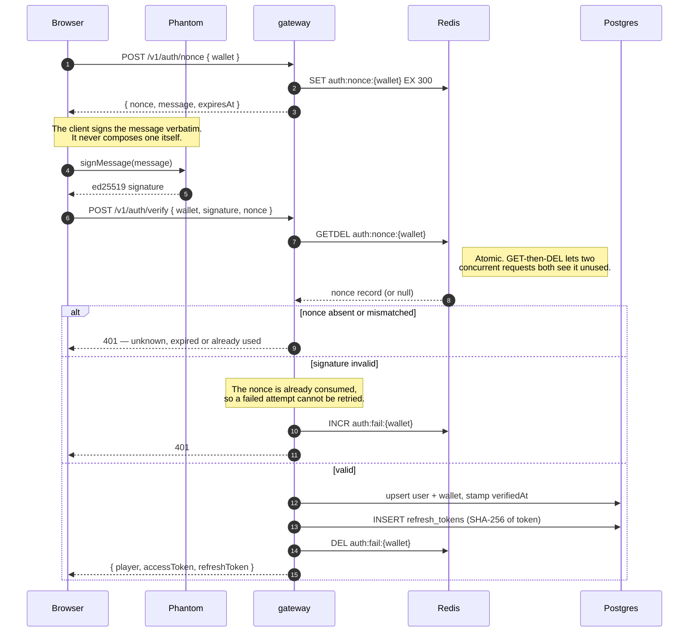
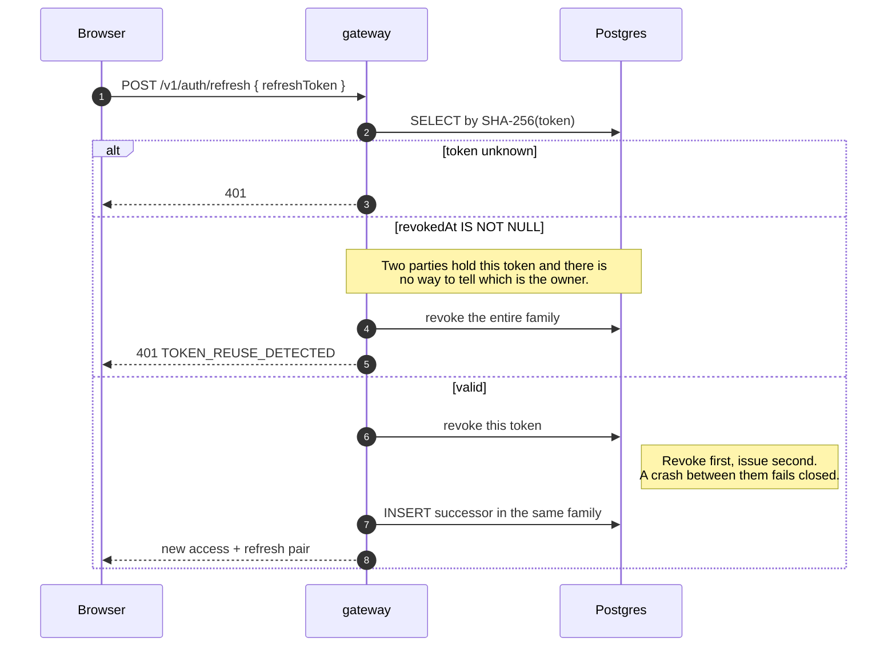
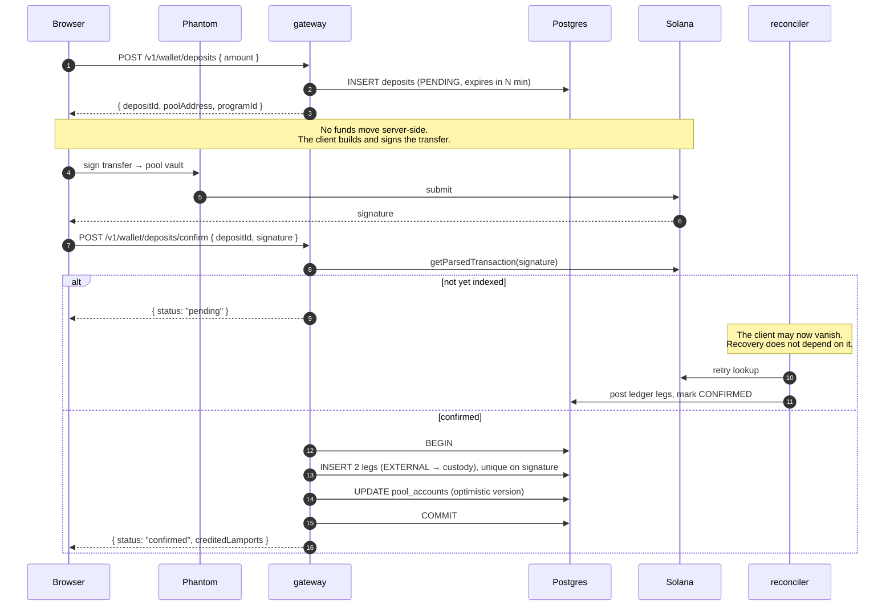
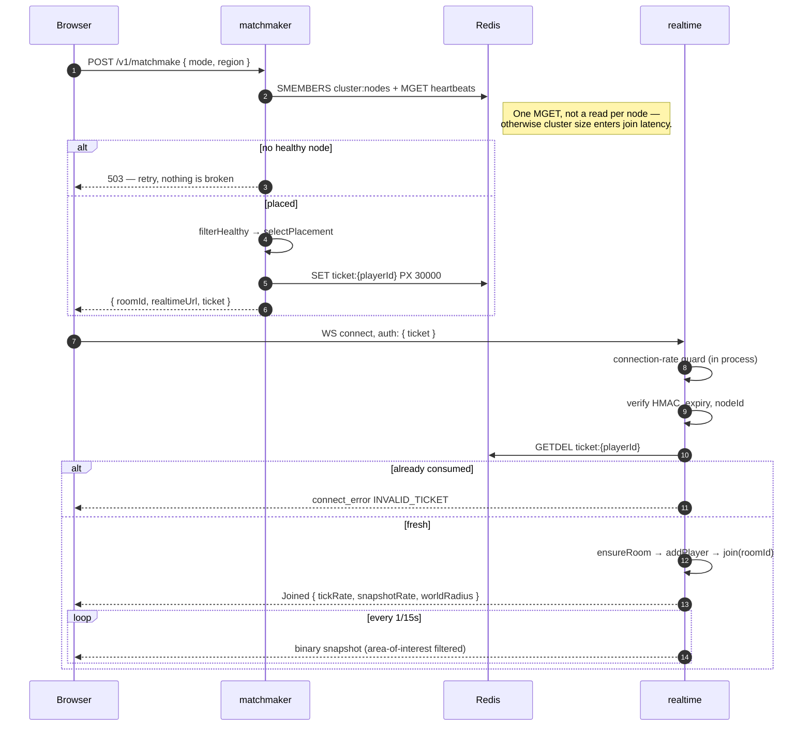
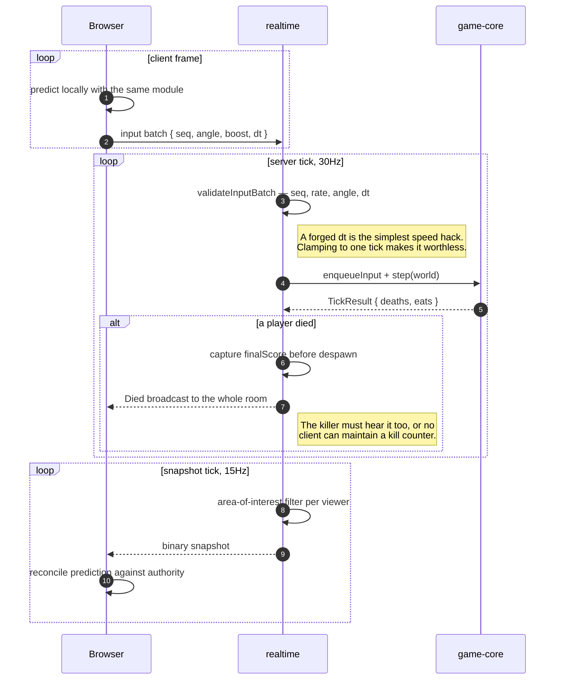
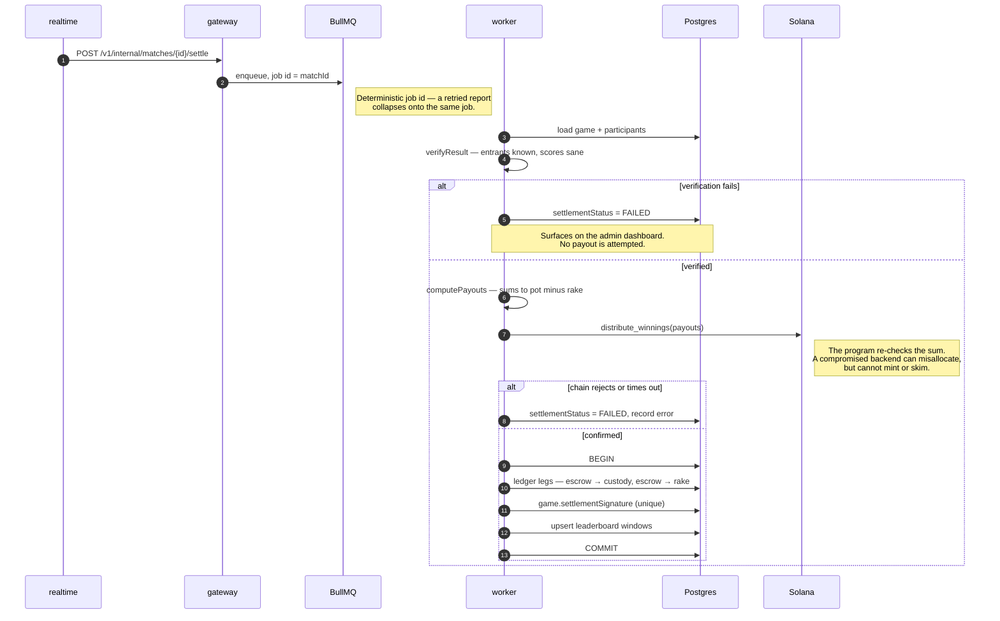
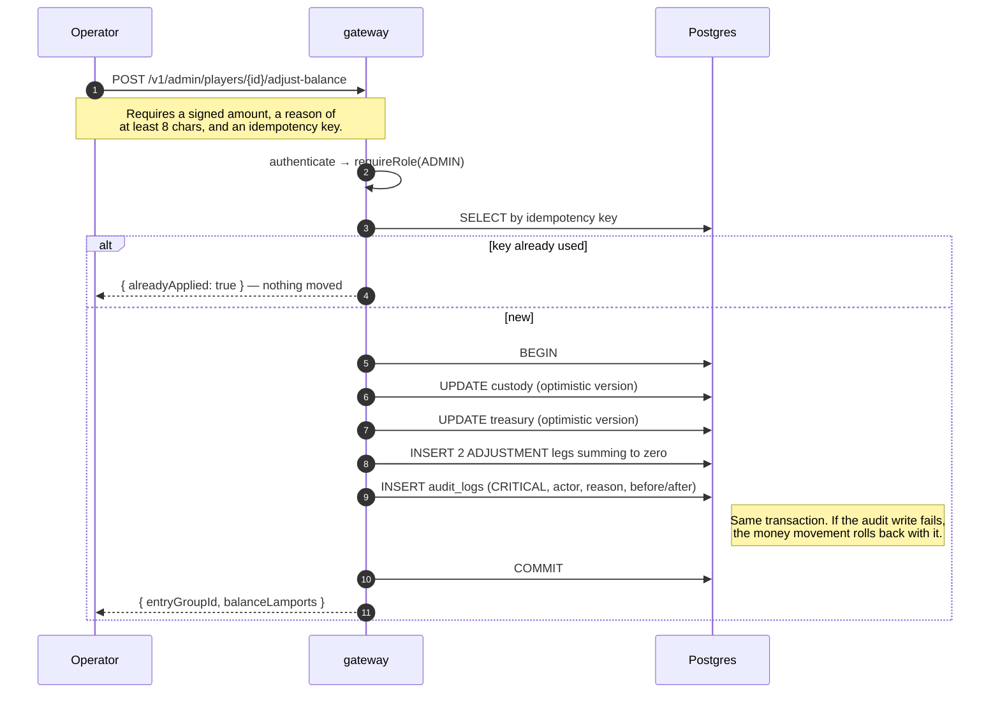
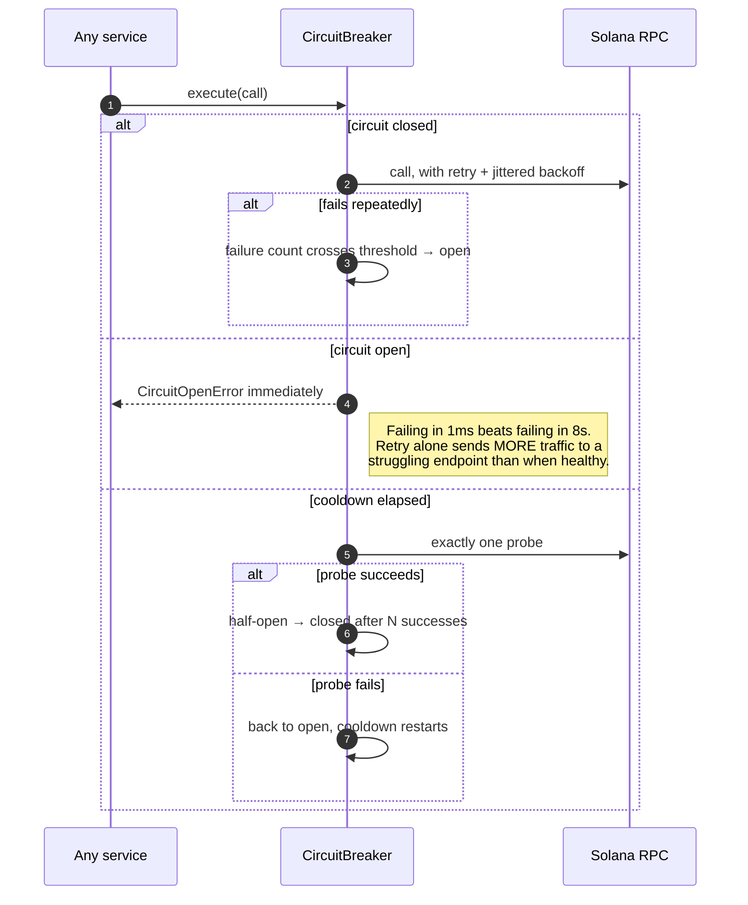

# Sequence diagrams

Seven flows. Each is annotated with the failure it is shaped to survive, because
that is usually why a step exists where a simpler design would have fewer.

## 1. Wallet sign-in

**Shaped by:** replay. The nonce is consumed _before_ the signature is checked,
so a captured message cannot be brute-forced against a challenge that would
otherwise stay alive for five minutes. The server rebuilds the signed message
from its own stored nonce — verifying a client-supplied string would let a caller
sign `"hello"` and present it as proof of anything.

## 2. Refresh rotation and theft detection

**Shaped by:** token theft. Logging a legitimate user out is a far cheaper
mistake than leaving a thief with a live session, so ambiguity resolves toward
revocation.

## 3. Deposit

**Shaped by:** the client disappearing between signing and confirming. The money
has moved on chain but the database does not know it. `pending` is a real
outcome rather than a blocking wait, and the reconciler closes the gap. Crediting
is keyed on the signature by a unique constraint, so the client and the
reconciler racing is safe — whichever arrives first posts, the other collides.

## 4. Join a match

**Shaped by:** a client choosing its own room. The ticket is a signed capability
naming one room on one node, so a modified client cannot join a friend's match to
grief them. It is HMAC-signed so the node validates with no network call, _and_
registered in Redis so it is consumed exactly once — a signature alone would let
one ticket open unlimited sockets.

## 5. Playing a tick

**Shaped by:** bandwidth and cheating. Without per-viewer AOI filtering the
per-room cost is O(players²). Scores and positions are never accepted from a
client — only intent travels upward.

## 6. Settlement

**Shaped by:** paying twice. Idempotency is layered — a deterministic queue job
id, a unique `settlementSignature`, unique ledger idempotency keys, and the
program's own once-only state transition. Any single layer failing still leaves
the pot payable exactly once.

## 7. Admin balance adjustment

**Shaped by:** an operator moving money with no trace. The audit row is written
_inside_ the same transaction as the change, so there is no path that produces a
balance change nobody can account for. Logging afterwards would leave a window,
and that window is exactly where a hostile or careless operator hides.

## Cross-cutting: what happens when the chain is unreachable

**Shaped by:** amplifying an upstream outage. A single probe rather than
reopening the floodgates, because the whole backlog arriving at an endpoint that
has had no time to recover reads as flapping and gets blamed on the endpoint.
